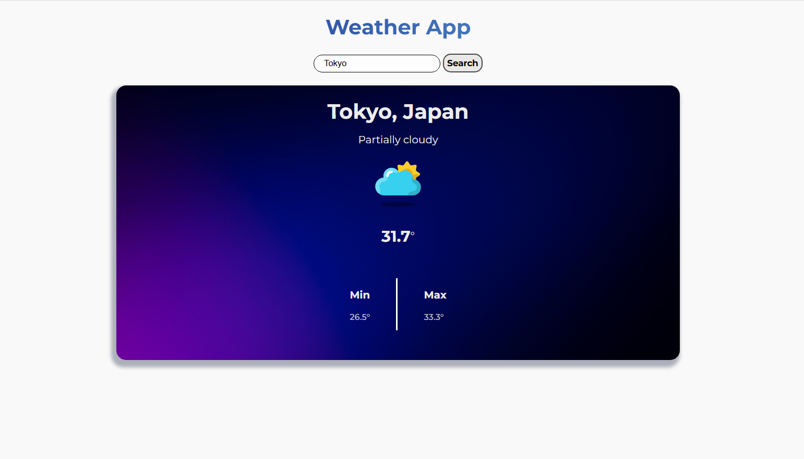

# Weather App

A simple, elegant weather application built with HTML, CSS, and JavaScript. This app allows users to search for weather information for any location worldwide, displaying key details such as temperature, conditions, and daily high/low temperatures. The project is bundled with Webpack and uses the Visual Crossing Weather API.


---

## Features

- **Search Functionality:** Enter a city or location to get current weather data.
- **Current Weather Display:** Shows temperature, weather conditions, and location.
- **Daily Min/Max Temperatures:** Displays minimum and maximum expected temperatures for the day.
- **Dynamic Weather Icons:** Weather icons change based on current conditions.
- **Responsive Design:** Works well on all screen sizes.
- **Modern UI:** Uses Montserrat font and a clean, card-based layout.

---

## Technologies Used

- **HTML5:** Structure of the web application.
- **CSS3:** Styling and responsive layout.
- **JavaScript (ES6+):** Fetching and processing weather data, DOM updates.
- **Webpack:** Bundling assets and modules.
- **Visual Crossing Weather API:** Provides accurate weather data.

---

## Setup and Installation

1. **Clone the repository:**
    ```bash
    git clone https://github.com/your-username/weather-app.git
    ```

2. **Navigate to the project directory:**
    ```bash
    cd weather-app
    ```

3. **Install dependencies:**
    ```bash
    npm install
    ```

4. **Obtain an API Key:**
    - Go to the [Visual Crossing Weather API website](https://www.visualcrossing.com/weather-api).
    - Sign up for a free account and get your API key.

5. **Insert your API Key:**
    - Open `src/weather-api.js`.
    - Replace the value of `API_KEY` with your key:
      ```js
      const API_KEY = 'YOUR_API_KEY_HERE';
      ```

6. **Start the development server:**
    ```bash
    npm start
    ```
    The app will open in your browser (usually at `http://localhost:8080`).

---

## Project Structure

```
weather-app/
│
├── src/
│   ├── index.js          # Main entry point
│   ├── render.js         # Renders weather data to the DOM
│   ├── weather-api.js    # Fetches and processes weather data
│   ├── weatherClass.js   # WeatherReport class
│   ├── styles.css        # Main stylesheet
│   ├── template.html     # HTML template
│   └── images/           # Weather icons and background
├── package.json
├── webpack.common.js
├── webpack.dev.js
├── webpack.prod.js
└── README.md
```

---

## How to Use

1. Open the app in your browser.
2. Enter a city or location in the search bar.
3. Click "Search" or press Enter.
4. View the current weather, conditions, and daily min/max temperatures.

---

## Credits

- Developed by Ghulam Mustafa Bhatti.
- Weather data provided by [Visual Crossing Weather API](https://www.visualcrossing.com/weather-api).
- Font: [Montserrat](https://fonts.google.com/specimen/Montserrat) from Google Fonts.

---

## License

This project is open source and available under the [MIT License](LICENSE)